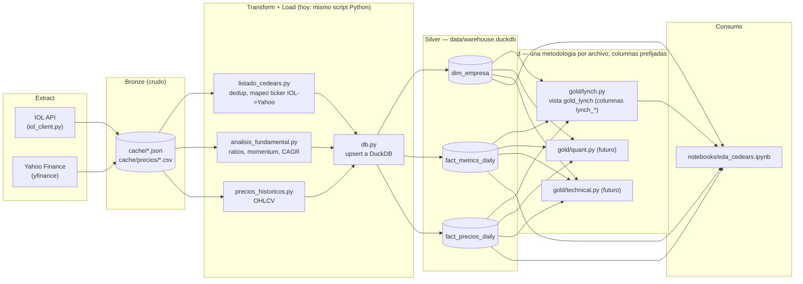

# CEDEARs Screener

Screener de acciones de EE.UU. y BDRs operables vía CEDEARs desde Argentina.
Fuentes de datos: API de InvertirOnline (universo + cotizaciones locales) y
Yahoo Finance / yfinance (fundamentales, precios y ratios de valuación de la
empresa detrás de cada CEDEAR).

## Arquitectura por capas



**Estado actual:** Transform y Load viven juntos, en Python (pandas), dentro de
cada script de Extract — es un ETL clásico, no ELT. **Roadmap:** migrar
Transform a modelos de `dbt` (dbt-duckdb) para separarlo de Extract y sumar
tests/documentación/lineage automático.

**Gold ya es real** (no vistas de ejemplo): cada metodología de análisis
(Lynch, y a futuro quant/técnico) vive en su propio archivo dentro de `gold/`,
crea su propia vista SQL en el warehouse, y prefija todas sus columnas
(`lynch_*`) — así conviven varias metodologías sobre las mismas empresas sin
que una le pise las columnas a otra.

## Arquitectura de datos

Warehouse local en `data/warehouse.duckdb` (un solo archivo, sin servidor),
modelo dimensional:

- **`dim_empresa`** — descriptiva, cambia poco (PK `ticker_usd`): identidad
  (tickers, mercado), `sector`/`industria`/`pais_origen` (de Yahoo), y
  `lynch_category`/`modelo_negocio` (clasificación manual/asistida por LLM,
  pendiente — ningún proveedor de datos la da gratis).
- **`fact_metrics_daily`** — un snapshot por día (PK `ticker_usd` + `fecha`):
  crecimiento de ingresos/ganancia, aceleración, CAGR de EPS, sorpresas de
  EPS, y todos los ratios de valuación (P/E, PEG, P/B, EV/EBITDA, márgenes,
  ROE, ROA, deuda/patrimonio, liquidez, dividendo, beta, tenencia
  insider/institucional).
- **`fact_precios_daily`** — un OHLCV por día (PK `ticker_usd` + `fecha`).

Cada tabla se carga con `UPSERT` (`ON CONFLICT ... DO UPDATE`), así que correr
un script dos veces el mismo día no duplica filas, y correrlo días distintos
sí acumula historial real (no pisa el día anterior).

## Orden de ejecución

```
python listado_cedears.py       # 1. Universo IOL -> dim_empresa (identidad)
python analisis_fundamental.py  # 2. Yahoo -> fact_metrics_daily + sector/industria en dim_empresa
python precios_historicos.py    # 3. Yahoo -> fact_precios_daily (OHLCV, 5 años)
python gold/lynch.py            # 4. Crea/actualiza la vista gold_lynch (no pide datos nuevos)
```

`listado_cedears.py` tiene que correr primero: los otros dos leen
`data/cedears_normalizados.csv` (el universo + el mapeo de ticker de IOL al
ticker real de Yahoo) para saber qué pedirle a Yahoo. `gold/lynch.py` corre
al final porque solo lee lo que ya está en el warehouse — no llama a IOL ni a
Yahoo.

### Agregar una metodología nueva en `gold/`

Cada archivo en `gold/` es independiente: crea su propia vista con
`CREATE OR REPLACE VIEW`, lee de `dim_empresa`/`fact_*` y prefija **todas**
sus columnas de salida (`lynch_*`, y a futuro `quant_*`, `technical_*`) para
que nunca choquen entre sí ni con las columnas de otra metodología. Para
importar `db.py` (vive en la raíz) desde `gold/`, cada script agrega la raíz
del proyecto a `sys.path` al principio — ver el encabezado de `gold/lynch.py`.

## Estructura
```
cedears-data-pipeline/
├── .env.example           # plantilla de credenciales (copiar a .env)
├── .gitignore
├── requirements.txt
├── db.py                  # conexion + schema + upserts de DuckDB
├── iol_client.py           # cliente de la API de IOL (auth + endpoints)
├── listado_cedears.py      # universo IOL -> dim_empresa + cedears_normalizados.csv
├── analisis_fundamental.py # momentum + ratios de Yahoo -> fact_metrics_daily
├── precios_historicos.py   # OHLCV de Yahoo -> fact_precios_daily
├── gold/                   # una metodologia de analisis = un archivo, columnas prefijadas
│   └── lynch.py            # vista gold_lynch (categoria + PEG + checklist estilo Peter Lynch)
├── notebooks/
│   └── eda_cedears.ipynb   # EDA sobre el warehouse (calidad de datos, sectores, valuación, momentum, precios, Lynch)
├── cache/                  # cache en disco por ticker (evita re-pedirle a Yahoo)
└── data/                   # se genera solo: CSVs + warehouse.duckdb
```

## Notebook de EDA

`notebooks/eda_cedears.ipynb` corre contra `data/warehouse.duckdb` (hay que
haber corrido los 3 scripts de arriba al menos una vez antes). Kernel
registrado como "Python 3 (.venv)" — si VS Code no lo detecta solo, `Ctrl+Shift+P`
→ "Notebook: Select Kernel" → elegir el del `.venv` del proyecto.

## Puesta en marcha (VS Code)

1. Abrir la carpeta en VS Code: `File > Open Folder...`

2. Crear el entorno virtual (terminal integrada, Ctrl+Ñ):
   ```bash
   python -m venv .venv
   ```

3. Activarlo:
   - Windows (PowerShell): `.venv\Scripts\Activate.ps1`
   - Mac/Linux: `source .venv/bin/activate`

4. Seleccionar el intérprete: `Ctrl+Shift+P` > "Python: Select Interpreter" > el de `.venv`.

5. Instalar dependencias:
   ```bash
   pip install -r requirements.txt
   ```

6. Configurar credenciales: copiar `.env.example` a `.env` y completar
   con tu usuario y clave de IOL.
   ```bash
   cp .env.example .env   # en Windows: copy .env.example .env
   ```

7. Correr, en este orden (ver "Orden de ejecución" más abajo):
   ```bash
   python listado_cedears.py
   python analisis_fundamental.py
   python precios_historicos.py
   python gold/lynch.py
   ```

## Notas
- La API de IOL debe estar habilitada en tu cuenta:
  Mi Cuenta > Personalización > APIs (aceptar términos).
- El `.env` con tus credenciales NUNCA se sube al repo.
- Consultar cotizaciones es solo lectura; las órdenes impactan en el entorno real.

## Troubleshooting: `SSLCertVerificationError` al conectar con IOL
Si tenés Norton (u otro antivirus con "SSL/TLS scanning") instalado, intercepta el
HTTPS de `api.invertironline.com` con un certificado propio que no está en el
bundle de certificados de Python (`certifi`), aunque sí está instalado en el
almacén de Windows (por eso el navegador funciona bien pero los scripts de Python no).

Solución (sin desactivar la protección del antivirus):
1. Exportar el certificado raíz de Norton desde el almacén de Windows:
   ```powershell
   $cert = Get-ChildItem Cert:\CurrentUser\Root | Where-Object { $_.Subject -like "*Norton*" } | Select-Object -First 1
   $pem = "-----BEGIN CERTIFICATE-----`n" + [Convert]::ToBase64String($cert.RawData, 'InsertLineBreaks') + "`n-----END CERTIFICATE-----"
   Set-Content -Path norton_root.pem -Value $pem -Encoding ascii
   ```
2. Combinarlo con el bundle de `certifi` en un archivo `combined_ca.pem`.
3. Agregar al `.env`:
   ```
   REQUESTS_CA_BUNDLE=C:\ruta\completa\a\combined_ca.pem
   ```
   Cada script ya hace `load_dotenv()` antes de crear el `IOLClient` o de
   llamar a yfinance, así que `requests` toma la variable automáticamente.

Si no usás Norton pero te da el mismo error, seguramente es otro antivirus/proxy
corporativo haciendo lo mismo — el diagnóstico es idéntico (`openssl s_client
-connect api.invertironline.com:443` te muestra quién firmó el certificado que
realmente estás recibiendo).

**El certificado de Norton rota de tanto en tanto.** Si un día `pip install`
o algún script que veía funcionar de repente tira el mismo
`SSLCertVerificationError` (incluso para hosts que antes andaban bien, como
`pypi.org`), no es un problema nuevo: hay que repetir el paso 1 (reexportar
`norton_root.pem`) y el paso 2 (reconstruir `combined_ca.pem`) con el
certificado actual del almacén de Windows — el archivo viejo quedó
desactualizado, no roto.
