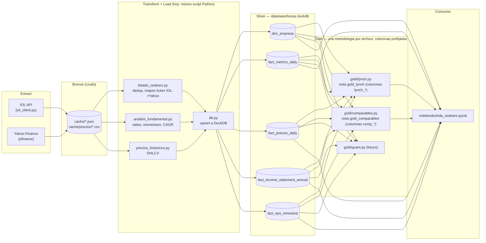

# CEDEARs Screener

Screener de activos operables desde Argentina: acciones de EE.UU./BDRs vía
CEDEARs, acciones argentinas locales (Merval y paneles relacionados), y
cripto. Fuentes de datos: API de InvertirOnline (universo CEDEARs + acciones
locales) y Yahoo Finance / yfinance (fundamentales, precios y ratios de
valuación de la empresa detrás de cada activo).

`dim_empresa.mercado` distingue las cuatro fuentes:

| `mercado` | Qué es | `ticker_yahoo` |
|---|---|---|
| `usa_otros` | CEDEAR de empresa de EE.UU. (u otra bolsa no-Brasil) | Ticker de EE.UU./exchange original |
| `brasil` | CEDEAR de BDR brasileño | `<ticker>.SA` |
| `argentina_local` | Acción local de BYMA (no es CEDEAR, es la empresa argentina en sí) | `<ticker>.BA` |
| `cripto` | BTC/ETH/SOL, fijos, no vienen de IOL | `<ticker>-USD` |

Las 13 acciones argentinas que además cotizan como ADR directo en EE.UU.
(GGAL, BMA, YPF, PAM, CRESY, SUPV, LOMA, EDN, TGS, TEO, BBAR, IRS, CEPU)
suman ese ticker en `dim_empresa.ticker_adr_usa` — no reemplaza al `.BA`, es
un dato extra para comparar precio local vs. ADR (brecha cambiaria
implícita). Cripto no tiene fundamentales (no hay balance ni ganancias que
pedir), así que `analisis_fundamental.py` la saltea — solo alimenta
`fact_precios_daily` vía `precios_historicos.py`.

## Arquitectura por capas



**Estado actual:** Transform y Load viven juntos, en Python (pandas), dentro de
cada script de Extract — es un ETL clásico, no ELT. **Roadmap:** migrar
Transform a modelos de `dbt` (dbt-duckdb) para separarlo de Extract y sumar
tests/documentación/lineage automático.

**Gold ya es real** (no vistas de ejemplo): cada metodología de análisis
(Lynch, y a futuro quant/técnico) vive en su propio archivo dentro de `gold/`,
crea su propia vista SQL en el warehouse, y prefija todas sus columnas
(`lynch_*`) — así conviven varias metodologías sobre las mismas empresas sin
que una le pise las columnas a otra.

## Arquitectura de datos

Warehouse local en `data/warehouse.duckdb` (un solo archivo, sin servidor),
modelo dimensional:

- **`dim_empresa`** — descriptiva, cambia poco (PK `ticker_usd`): identidad
  (tickers, mercado), `sector`/`industria`/`pais_origen` (de Yahoo), y
  `lynch_category`/`modelo_negocio` (clasificación manual/asistida por LLM,
  pendiente — ningún proveedor de datos la da gratis).
- **`fact_metrics_daily`** — un snapshot por día (PK `ticker_usd` + `fecha`):
  crecimiento de ingresos/ganancia, aceleración, CAGR de EPS, sorpresas de
  EPS, y todos los ratios de valuación (P/E, PEG, P/B, EV/EBITDA, márgenes,
  ROE, ROA, deuda/patrimonio, liquidez, dividendo, beta, tenencia
  insider/institucional).
- **`fact_precios_daily`** — un OHLCV por día (PK `ticker_usd` + `fecha`).
- **`fact_income_statement_annual`** — ingresos/ganancia neta en $ por balance
  anual (PK `ticker_usd` + `fecha_balance`). Es la serie real detrás de
  `crecimiento_ingresos_anual_pct` — para graficar tendencia, no solo el %.
- **`fact_eps_trimestral`** — EPS estimado/reportado por trimestre (PK
  `ticker_usd` + `fecha_reporte`), incluye el **próximo** informe (todavía
  sin `eps_reportado`) para saber cuándo es el próximo reporte.
- **`fact_balance_cashflow_annual`** — deuda total, efectivo y flujo de caja
  libre por balance anual (PK `ticker_usd` + `fecha_balance`).
- **`log_ejecuciones`** — append-only, una fila por corrida de cada script
  (`ok`/`error`, cuántas filas afectó, y el detalle si falló). Sirve para
  tres cosas: idempotencia (no repetir un job que ya corrió hoy si el
  catch-up de Task Scheduler dispara dos veces el mismo día), tablero de
  salud (`python estado_pipeline.py`), y diagnóstico (el error queda
  guardado, no hay que rescatarlo de la terminal).

Cada tabla de datos se carga con `UPSERT` (`ON CONFLICT ... DO UPDATE`), así
que correr un script dos veces el mismo día no duplica filas, y correrlo días
distintos sí acumula historial real (no pisa el día anterior).

## Orden de ejecución

```
python listado_cedears.py       # 1. Universo IOL -> dim_empresa (identidad)
python analisis_fundamental.py  # 2. Yahoo -> fact_metrics_daily + sector/industria en dim_empresa
python precios_historicos.py    # 3. Yahoo -> fact_precios_daily (OHLCV, 5 años)
python gold/lynch.py            # 4. Crea/actualiza la vista gold_lynch (no pide datos nuevos)
python gold/comparables.py      # 5. Crea/actualiza la vista gold_comparables (idem, no pide datos nuevos)
```

`listado_cedears.py` tiene que correr primero: los otros dos leen
`data/cedears_normalizados.csv` (el universo + el mapeo de ticker de IOL al
ticker real de Yahoo) para saber qué pedirle a Yahoo. `gold/lynch.py` corre
al final porque solo lee lo que ya está en el warehouse — no llama a IOL ni a
Yahoo.

Todos los scripts (menos las vistas `gold/`) chequean `db.ya_corrio_hoy()` al
arrancar y no repiten el trabajo si ya corrieron con éxito hoy — pensado para
que un catch-up de Task Scheduler (PC apagada a la hora programada, corre al
prenderla) no dispare una segunda corrida redundante el mismo día.

### Cadencia (pensada para Task Scheduler, todavía no configurado)

No todo necesita correr con la misma frecuencia — depende de qué tan rápido
cambia cada fuente:

| Cadencia | Qué corre | Por qué |
|---|---|---|
| Diaria (~20:00 ART) | `precios_historicos.py` | El precio cambia todos los días hábiles |
| Diaria (~20:00 ART) | `analisis_fundamental.py` — parte liviana (`.info`) | Ratios como P/E se mueven con el precio, aunque la empresa no cambie |
| Diaria (~20:00 ART) | `gold/lynch.py`, `gold/comparables.py` | Solo recalculan sobre lo que ya se actualizó — sin costo de API |
| Semanal (domingos ~20:00 ART) | `listado_cedears.py` | El universo de CEDEARs rara vez cambia |
| Semanal (domingos ~20:00 ART) | `analisis_fundamental.py` — parte pesada (income statement, balance, cashflow, earnings) | Los balances solo cambian ~4 veces al año |
| Mensual | Nada automatizado todavía | Reservado para revisión manual de `lynch_category`/`modelo_negocio` |

20:00 ART queda después del cierre de BYMA (17:00) y de NYSE/NASDAQ (17:00–18:00
ART según horario de verano en EE.UU.), con margen para que Yahoo termine de
asentar el dato del día. La separación liviana/pesada de `analisis_fundamental.py`
en dos cadencias todavía no está implementada — hoy el script hace las 5
llamadas cada vez que corre.

### Agregar una metodología nueva en `gold/`

Cada archivo en `gold/` es independiente: crea su propia vista con
`CREATE OR REPLACE VIEW`, lee de `dim_empresa`/`fact_*` y prefija **todas**
sus columnas de salida (`lynch_*`, y a futuro `quant_*`, `technical_*`) para
que nunca choquen entre sí ni con las columnas de otra metodología. Para
importar `db.py` (vive en la raíz) desde `gold/`, cada script agrega la raíz
del proyecto a `sys.path` al principio — ver el encabezado de `gold/lynch.py`.

## Estructura
```
cedears-data-pipeline/
├── .env.example           # plantilla de credenciales (copiar a .env)
├── .gitignore
├── requirements.txt
├── db.py                  # conexion + schema + upserts de DuckDB
├── iol_client.py           # cliente de la API de IOL (auth + endpoints)
├── listado_cedears.py      # universo IOL (CEDEARs + acciones argentinas) + criptomonedas fijas -> dim_empresa + cedears_normalizados.csv
├── analisis_fundamental.py # momentum + ratios de Yahoo -> fact_metrics_daily + series crudas (income statement, EPS)
├── precios_historicos.py   # OHLCV de Yahoo -> fact_precios_daily
├── estado_pipeline.py      # tablero de salud: ultima corrida (ok/error) de cada script
├── gold/                   # una metodologia de analisis = un archivo, columnas prefijadas
│   ├── lynch.py            # vista gold_lynch (categoria + PEG + checklist estilo Peter Lynch)
│   └── comparables.py      # vista gold_comparables (empresa vs. mediana de su sector + pares similares)
├── notebooks/
│   └── eda_cedears.ipynb   # EDA sobre el warehouse (calidad de datos, sectores, valuación, momentum, precios, Lynch, vista por acción)
├── cache/                  # cache en disco por ticker (evita re-pedirle a Yahoo)
└── data/                   # se genera solo: CSVs + warehouse.duckdb
```

## Notebook de EDA

`notebooks/eda_cedears.ipynb` corre contra `data/warehouse.duckdb` (hay que
haber corrido los 3 scripts de arriba al menos una vez antes). Kernel
registrado como "Python 3 (.venv)" — si VS Code no lo detecta solo, `Ctrl+Shift+P`
→ "Notebook: Select Kernel" → elegir el del `.venv` del proyecto.

## Puesta en marcha (VS Code)

1. Abrir la carpeta en VS Code: `File > Open Folder...`

2. Crear el entorno virtual (terminal integrada, Ctrl+Ñ):
   ```bash
   python -m venv .venv
   ```

3. Activarlo:
   - Windows (PowerShell): `.venv\Scripts\Activate.ps1`
   - Mac/Linux: `source .venv/bin/activate`

4. Seleccionar el intérprete: `Ctrl+Shift+P` > "Python: Select Interpreter" > el de `.venv`.

5. Instalar dependencias:
   ```bash
   pip install -r requirements.txt
   ```

6. Configurar credenciales: copiar `.env.example` a `.env` y completar
   con tu usuario y clave de IOL.
   ```bash
   cp .env.example .env   # en Windows: copy .env.example .env
   ```

7. Correr, en este orden (ver "Orden de ejecución" más abajo):
   ```bash
   python listado_cedears.py
   python analisis_fundamental.py
   python precios_historicos.py
   python gold/lynch.py
   python gold/comparables.py
   ```

## Notas
- La API de IOL debe estar habilitada en tu cuenta:
  Mi Cuenta > Personalización > APIs (aceptar términos).
- El `.env` con tus credenciales NUNCA se sube al repo.
- Consultar cotizaciones es solo lectura; las órdenes impactan en el entorno real.

## Troubleshooting: `SSLCertVerificationError` al conectar con IOL
Si tenés Norton (u otro antivirus con "SSL/TLS scanning") instalado, intercepta el
HTTPS de `api.invertironline.com` con un certificado propio que no está en el
bundle de certificados de Python (`certifi`), aunque sí está instalado en el
almacén de Windows (por eso el navegador funciona bien pero los scripts de Python no).

Solución (sin desactivar la protección del antivirus):
1. Exportar el certificado raíz de Norton desde el almacén de Windows:
   ```powershell
   $cert = Get-ChildItem Cert:\CurrentUser\Root | Where-Object { $_.Subject -like "*Norton*" } | Select-Object -First 1
   $pem = "-----BEGIN CERTIFICATE-----`n" + [Convert]::ToBase64String($cert.RawData, 'InsertLineBreaks') + "`n-----END CERTIFICATE-----"
   Set-Content -Path norton_root.pem -Value $pem -Encoding ascii
   ```
2. Combinarlo con el bundle de `certifi` en un archivo `combined_ca.pem`.
3. Agregar al `.env`:
   ```
   REQUESTS_CA_BUNDLE=C:\ruta\completa\a\combined_ca.pem
   ```
   Cada script ya hace `load_dotenv()` antes de crear el `IOLClient` o de
   llamar a yfinance, así que `requests` toma la variable automáticamente.

Si no usás Norton pero te da el mismo error, seguramente es otro antivirus/proxy
corporativo haciendo lo mismo — el diagnóstico es idéntico (`openssl s_client
-connect api.invertironline.com:443` te muestra quién firmó el certificado que
realmente estás recibiendo).

**El certificado de Norton rota de tanto en tanto.** Si un día `pip install`
o algún script que veía funcionar de repente tira el mismo
`SSLCertVerificationError` (incluso para hosts que antes andaban bien, como
`pypi.org`), no es un problema nuevo: hay que repetir el paso 1 (reexportar
`norton_root.pem`) y el paso 2 (reconstruir `combined_ca.pem`) con el
certificado actual del almacén de Windows — el archivo viejo quedó
desactualizado, no roto.
